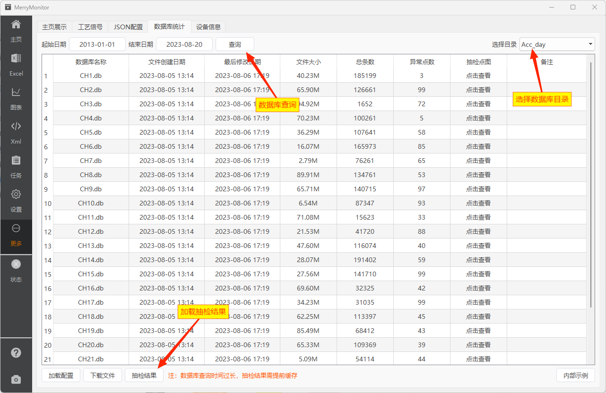

::: info
检查设备功能时，常常需要统计数据库的条数。

为提高自动化程度，特意设计了一组页面，方便大家查看当前设备的数据库统计情况。
:::

## 页面标注

数据库查询与抽检结果的加载，均需要提前安装 [后端扩展服务](./mainpage.md#web后端扩展)。

## 数据库查询

数据库查询以Http方式携带起止日期，向设备发起查表请求。

## 抽检结果

数据库抽检的主要方式为：从数据表中，等间隔抽检最多64个点(起始位置随机，提高抽检质量)。

检查这些二进制数据中，含0的百分比。**百分比越高，无效数据的可能性越高。**

超过80%的情况，标记为异常点数。

由于数据表众多，一次抽检往往需要扫描200多张表甚至上千张表，且都是大数据量的二进制数据。

每次Http请求抽检一次不现实。

因此，抽检功能通过向 systemd 注册定时服务的方式，在后台每小时刷新一次缓存，由Http请求返回该缓存结果。

## 后续改动

**V3.0版本后，硬件设备将不再支持抽检结果。**

数据库的查阅，可通过另一个近期已经发布的桌面软件进行。抽检功能已经从硬件设备中移除。
