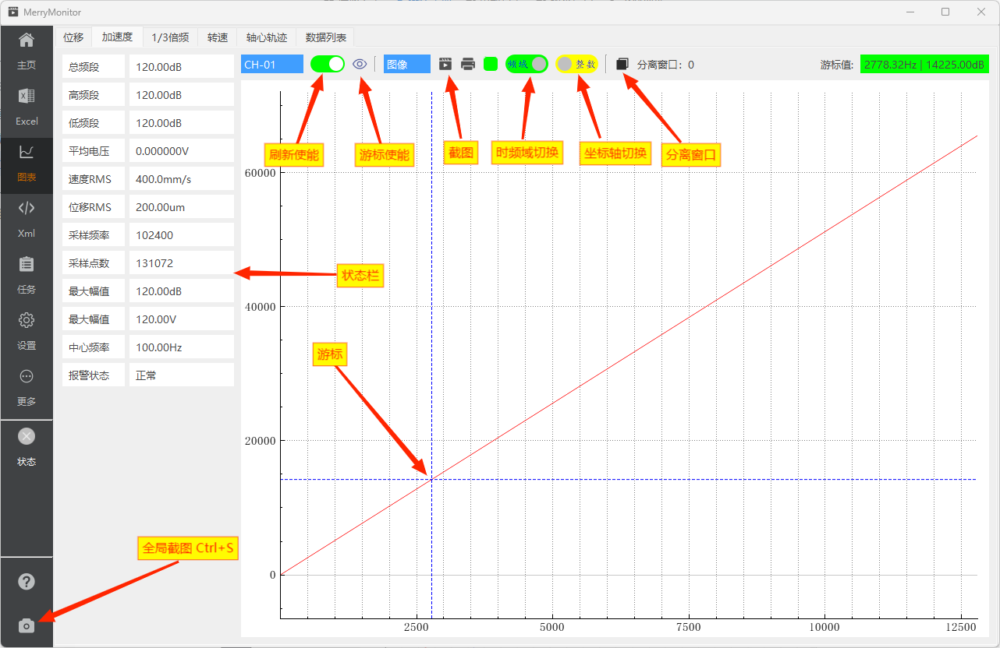
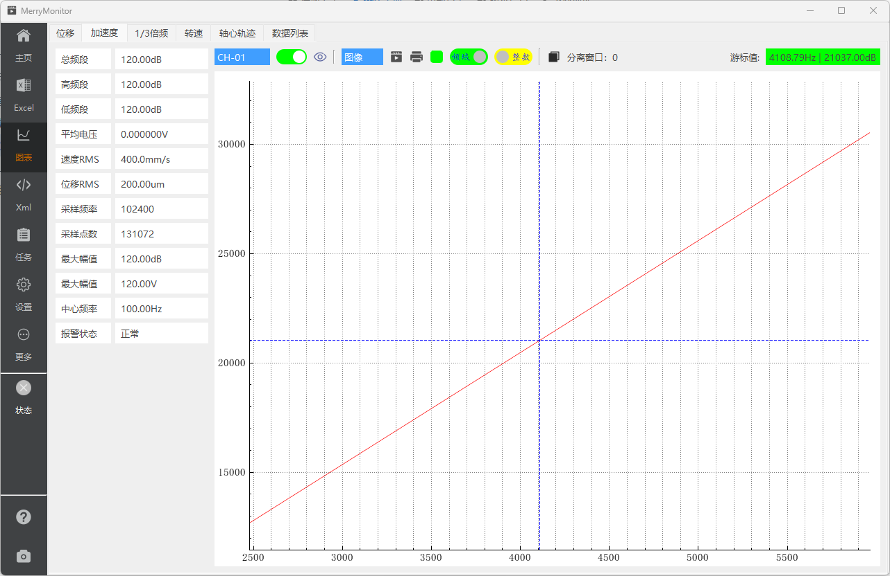

::: info 图表展示
图表功能的构建，基于[QCustomPlot](https://www.qcustomplot.com/)开源库的支持。

图表功能囊括了项目中常见的几类图表。使用频率最高的位移、加速度图；使用频率较低的1/3倍频、轴心轨迹；
以及计划将要加入的转速图功能。并且提供了特征值聚合后的数据列表。
:::

## 页面标注

图表功能提供了丰富的辅助控件，基本涵盖了大多数的应用场景与测试任务。

## 通道选择

一般来说，加速度通道的起始位置相比位移通道要更靠后。在查看加速度数据图谱时，应及时调整通道选择到 **你感兴趣的** 通道上。

## 数据游标

默认情况下，数据游标不可见。用户可通过点击游标使能，打开或关闭游标的显示。游标移动时，其坐标值实时更新在图表页右上角。

## 缩放方向

图表缩放同时支持滚轮缩放与拖动缩放，缩放方向默认为横向缩放，可通过开关修改为纵向缩放。
每次图表刷新网络数据时，都会重新计算纵向坐标轴的范围。如果你需要保持纵向缩放的范围，请提前关闭刷新使能。

同时，横向缩放设定了最大缩放范围。因此，反向使用横向缩放，都能回归到最初的图像状态。

## 屏幕截图

应用程序内置了截图功能。在测试过程中，常常需要保存图像状态，是一个高频的应用场景。
因此，应用程序同时提供了保存图像截图与保存图像数据文本两种方式的交互。当需要查看当前图像的文本数据时，则将保存类型切换到数据即可。

**此外，在侧边栏左下角额外提供了一个全局的截图按钮。该截图按钮支持 `Ctrl+S` 快捷键激活。**

## 幅频最大值

幅频最大值，由应用程序读取当前X轴的左右范围。在X轴的左右范围中，从原始图像数据中获取。

例如：当X轴的范围缩放至35000-70000的范围时，则在网络更新后，应用程序将从35000-70000的数据范围中寻找最大值。
范围之外的数据则不参与计算。

所以说，左侧的幅频最大值表现的是当前加速度图像中，X轴范围内的最大值。
这在某些需要查看一小段数据范围内的最大值时，是非常实用的。当然，也可以暂停刷新数据，通过游标的方向实现相同的目的。

