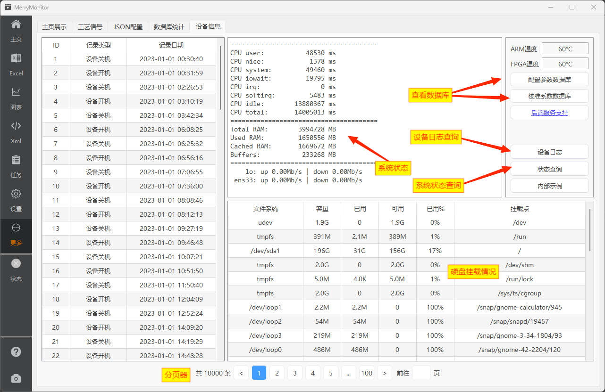

::: info
提供了本地数据库的查询入口、系统日志、及系统状态的查询。

为了减少Http的请求次数，这里选择将众多设备信息集中处理，耦合程度较高。
:::

## 页面标注

系统日志与系统状态的查询，均需要提前安装 [后端扩展服务](./mainpage.md#web后端扩展)。

## 本地数据库

每次使用校准系数保存功能时，应用程序自动在本地数据库中添加一条备份。

每次使用配置文件保存功能时，应用程序自动弹起数据保存确认框，由于配置文件与设备编号一一对应。**保存数据前请仔细核对，避免覆盖了其他设备的数据备份**。

当你需要回溯之前的校准系数或配置文件，可通过按钮对话框查看数据库保存的备份数据。

## 设备日志

该功能通过Http请求，提取保存在硬件设备中的日志信息。

**单次请求**返回全部的日志数据，通过分页器分页的方式展示在左侧表格中。

## 系统状态

单次请求，同时返回CPU、内存、网卡、硬盘的使用情况。

两次请求之间，计算一次网卡收发速率。

V3.0版本后，网络的收发情况可通过进度球的显示看到具体的数据包下载进度，不再提供网卡收发速率的显示。
