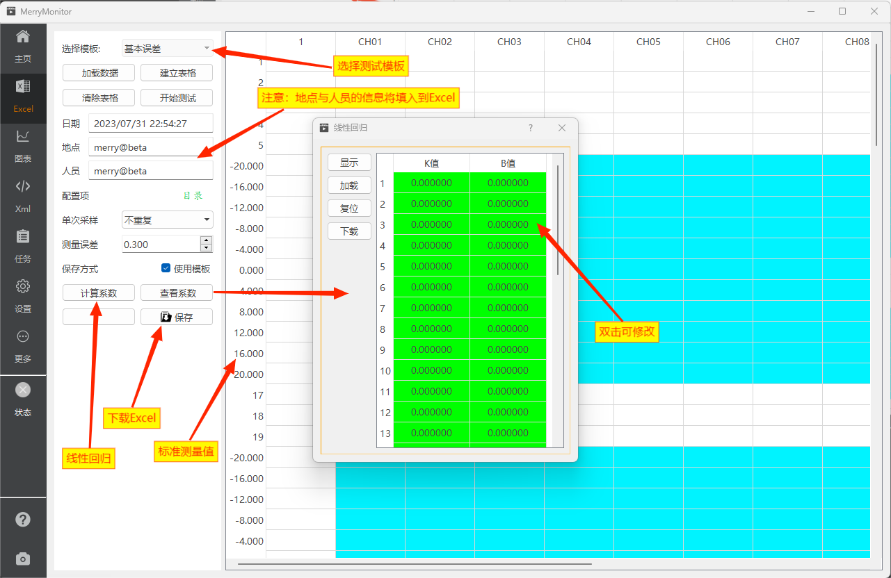

::: info 自动采集
测试表格是一组反应设备测试情况的所使用的excel表格。
应用程序内置了 基础误差、线性误差、零点漂移、重复性误差 四类测试表格。

自动采集功能。是一个借助应用程序的计算能力，减少测试过程中人工参与数据的判断与记录，并提供xlsx格式的excel模板导出数据，快速完成测试任务的一套流程。
:::

## 页面标注

采集过程中数据将呈现在右侧表格中，用户可通过编写表格中的数据，修改最终的测试结果。



## 新建任务

测试任务开始前，首先目标选择一个合适的测试任务，应用的默认测试任务为**基本误差**。
若需要切换至其他任务请按以下步骤进行：

::: info 操作步骤
1. 保存当前已经完成的测试表格。（可跳过）
2. 关闭当前测试，点击清除表格清空当前测试数据。
3. **清空测试数据后，模板选择下拉框将使能**。这时可重新选择内置的测试模板。
4. 点击加载数据可加载外部excel数据，或点击建立表格，建立一个空白表格。
5. 表格初始化完成后，若需要重新选择模板，则从步骤1重新开始。
6. 填写当前测试人员，调整测量误差。（可跳过）
7. 点击开始测试。
:::

任务建立后，即可重新回到主页，完成剩下的数据采集流程。

## 测量误差

自动采集过程中，由于任务之间存在不同的测试电压，应用在判断采集数据的外部电压时，需要提供一个允许的误差范围。

例如：当外部8个信号通道同时接入了4.000V的电压，而应用程序收到的电压数据如下时，将拒绝本次数据的采集。

``` c
CH1   CH2   CH3   CH4   CH5   CH6   CH7   CH8
3.997 3.998 4.000 4.001 4.002 3.996 3.688 3.999
```

由于 `CH7` 的电压与外部电压4.000V - 3.888V = 0.312V 大于设定的误差范围 `0.300`。
因此，本次的电压数据应用程序将拒绝采纳。

当应用程序收到的电压数据如下时，情况则相反。

``` c
CH1   CH2   CH3   CH4   CH5   CH6   CH7   CH8
3.997 3.998 4.000 4.001 4.002 3.996 4.003 3.999
```

由于 8个通道的电压数据与测试电压项 `4.000V` 的误差范围全部小于`0.300`。
因此，这次的电压数据应用程序将会主动判断为 `4.000V` 的测试数据进行采纳。并将其更新至右侧表格视图中。

## 线性回归

点击计算系数按钮，应用程序将根据右侧表格中的数据计算线性回归的系数。
计算结束后，通过点击查看系数按钮查看计算结果，并提供XML文件格式的加载、修改及下载功能。

目前线性回归的默认XML文件名为 `SIGCorrect.xml`，仅支持 **基本误差** 的线性回归计算。

## 下载excel

测试完成后，需要导出测试表格的数据时，点击保存按钮选择存放路径即可。
excel文件默认使用xlsx格式。下载excel文件时，应用默认带上内置的样式模板。
如您不需要这些模版，可以在下载文件前，取消勾选 **使用模板** 选项。
