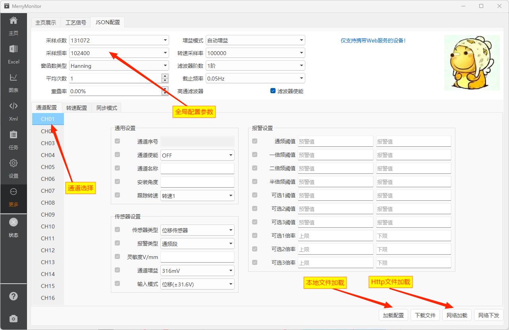

::: info 配置可视化
与XML的可视化不同的是，JSON配置文件是将已经在Web端实现的可视化UI重新搬到Qt上实现的一个兼容性功能。

多端统一，方便在使用桌面软件的情况下，通过加载本地配置文件的方式进行修改。
:::

## 页面标注

配置文件的加载方式，提供了本地文件加载与Http网络加载两种方式。

**其中Http部分的接口和Web程序使用的接口是一致的。** 

不支持Web服务的设备，不能使用该功能。

## 通道配置

点击左侧通道按钮，中央区域的配置界面将切换到对应的通道内容。

::: warning
下载配置文件前，你必须确保已经加载了一个 `config.json` 文件，应用程序需要使用模板文件以确保不会遗漏那些 **你正在使用，但又不需要可视化** 的标签。
:::

## 同步模式

同步模式功能请参考 [XML配置](./xmlview.md#同步模式)。

## 注意事项

::: warning
JSON的数据类型分为 String、Boolean、Number。

由于JSON字段强制要求必须指定数据类型。根据实际情况，配置字段在保存JSON数据时，将强制转换成对应的数据类型。

**其中浮点数仅保存两位有效数字。**
:::
