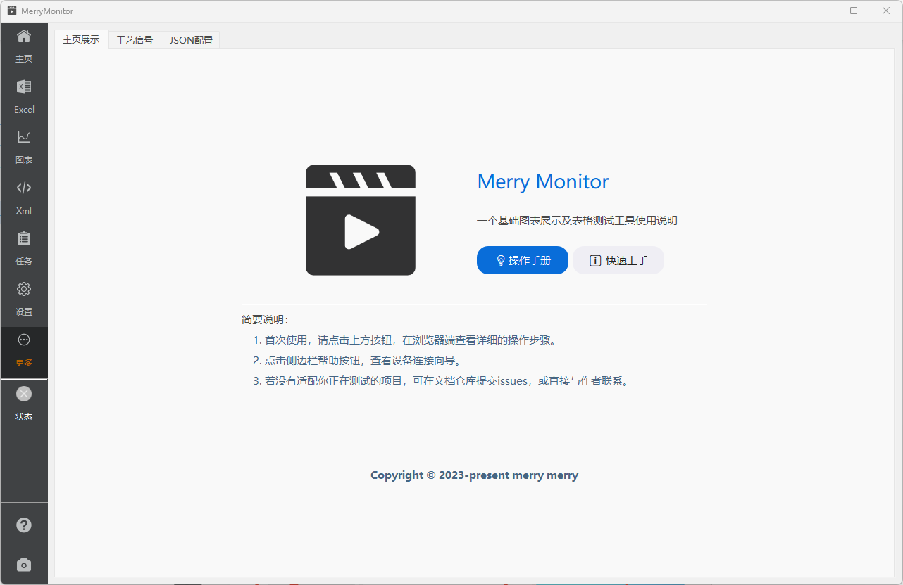
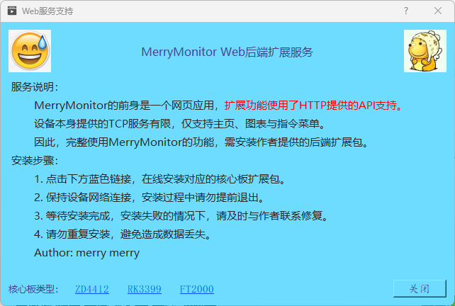

::: info 收纳页
随着后续版本增加了越来越多的功能页，侧边栏导航已经无法容纳更多的设置。

因此，一些后期增加但又不是很重要的功能页将收纳至二级导航。方便临时增减功能页，整体观感上也不会显得很突兀。
:::

展示页提供了快捷抵达本文档的入口按钮。

::: info 功能按钮说明
1. 操作手册 浏览器打开文档地址。
2. 快速上手 浏览器打开文档地址。
3. 说明向导 打开向导对话框，查看设备连接步骤说明。
4. 扩展服务 Web后端扩展，为设备提供API支持。
5. 检测更新 作为内网使用的在线更新功能。
6. 设备关机 设备电源控制，**需Web后端扩展支持**。
:::

## Web后端扩展

安装扩展前，**需提前完成设备的TCP连接，以验证设备网络的连通性**。应用程序通过 ssh 连接的方式与设备建立交互，并完成后续的整个的安装过程。
