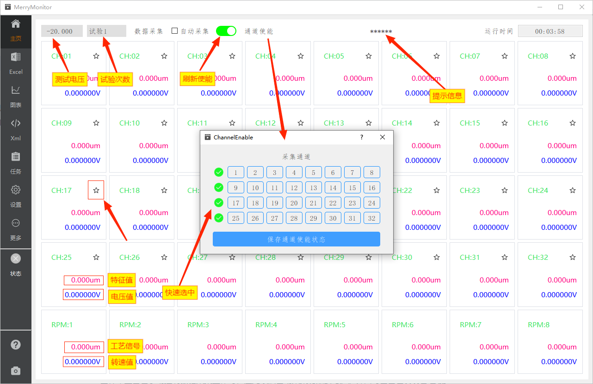

::: info 数据监控
主屏页主要负责采集通道的特征值、电压值、转速值、工艺信号的数据展示。

又同时作为测试任务的操作面板，提供了部分控制按钮与显示信息。测试人员可通过调整通道使能、测试电压、点击数据采集按钮完成数据的采集工作。
:::

## 页面标注

通道组与工具栏的说明，请对照图片上的标注信息。

## 手动采集

当你使用自动采集功能时，应用程序将接管 **测试电压、试验次数、数据采集** 这几个功能按钮。

当你希望自己手动控制数据采集工作时，应先取消自动采集功能的勾选。并同时由自己负责管理 **测试电压、试验次数** 的选择。
通常来说，外部输入电压是多少，测试电压就选择多少。

此外有个注意点，测试电压、试验次数还会受到不同的[测试任务](./excel.md#页面标注)影响而出现不同的选项。

## 提示信息

尽管大多数情况下，自动采集能迅速地完成测试任务。
但有时因为外界的一些干扰或者遇到一些硬件问题的时候，应用程序一直无法得到一个[有效的可接纳的测试数据值](./excel.md#测量误差)。

这时，需要测试人员注意观察通道间出现异常的数据，及时处理问题，并且应用程序也会将计算过程中遇到异常的通道号标注在顶部的提示信息上。

## 通道使能

应用程序默认开启了32个通道的使能。因为测试方法的不同，有时可能仅仅需要其中的几个通道。

这种情况下，你可以通过点击通道使能，弹出对话框。通过选中或取消对应的通道，改变应用程序需要关注的测试通道使能。
通道的使能情况也将同步反应到数据展示框内 **右上角的星星图标** 上。
