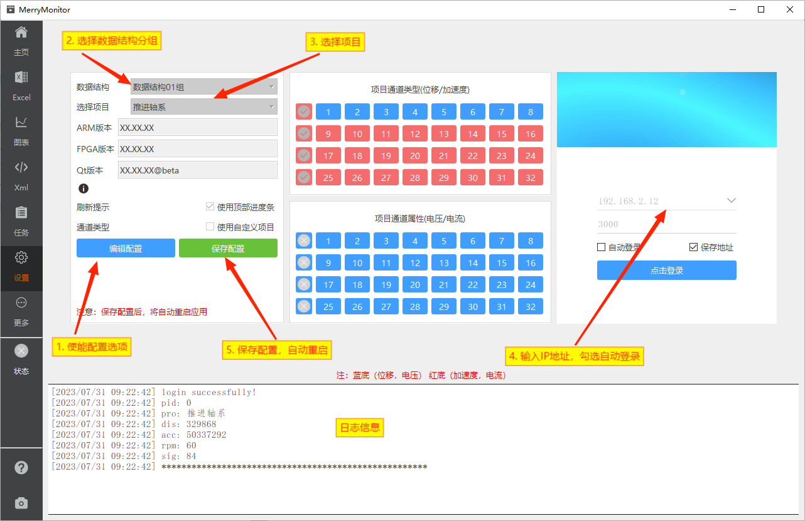
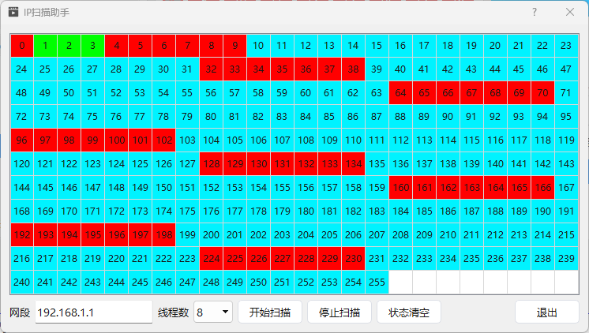

::: info 项目介绍
随着时间的推移，不同的项目需求积累了众多的上位机版本，只对特定项目有效。

作者的主业是FPGA开发，平日里也是个网瘾少年，对Linux、前端、算法都有些涉猎。在写这款桌面软件之前，已经接近两年时间没用过Qt开发了。

为什么不选择Web方案？有尝试过，因为TCP的性能支撑不住，才重新选择Qt。

正因如此，希望能通过这一版桌面程序，整合测试流程。

在这个项目中，借鉴了不少前端的设计思想与算法技巧，完成了设备接口的统一抽象。

**一个可以兼容绝大多数项目的桌面测试软件。**
:::

## 页面标注

连接设备网络前，请先选择合适的数据结构组与项目。同时注意中间部分的通道类型与属性，是否与当前设备的情况保持一致。

## 选择内置项目

::: info 操作流程
1. 点击**编辑设置**，使能 **数据结构、选择项目、自定义项目** 等配置项。
2. 点击**数据结构、选择项目**，按照当前正在进行的项目，选中对应的项目。
3. 在右侧登录框中输入设备的IP地址及端口号，下拉框中内置了一些常用IP地址。
4. 如需在设备启动后，自动进行登录操作，可勾选自动登录。
5. 点击左侧保存设置，将选择后的配置保存至本地，配置将在下次启动时生效。
6. **重启测试软件。**
:::

## 选择自定义项目

当你正在测试的设备，不属于内置项目的一种，但其数据结构又归属在某个数据结构分组下。你可以使用自定义项目功能。

::: info 操作流程
1. 点击**编辑设置**，使能 **数据结构、选择项目、自定义项目** 等配置项。
2. 点击**自定义项目**，这时，左侧的通道类型、通道属性的将使能。
3. 你可以通过点击这些类型、属性按钮调整配置，以适配你当前正在进行的测试设备。
4. 点击**数据结构**，选择合适的数据结构分组。
5. 在右侧登录框中输入设备的IP地址及端口号，可勾选自动登录。
6. 点击左侧保存设置，将选择后的配置保存至本地，配置将在下次启动时生效。
7. **重启测试软件。**
:::

## IP扫描助手

V2.2.0 新增功能 <badge text="注" type="tip" /> 

根据作者自己的实际使用体验。发现绝大多数情况下，可能知道设备的网段地址，但不知道设备的具体地址是多少。

扫描助手通过扫描全网段的IP地址来**辅助判断可能的设备地址**。最高支持8线程同时扫描。

## 网络连接

应用程序在IP下拉框中，内置了部分常用的IP地址。
勾选自动登录的情况下，应用程序启动时，将会为你尝试使用保存的地址进行登录。

应用程序的日志系统，仅保留了网络部分的日志信息。以避免在长期运行的设备中，出现太多不关心的日志输出。
日志内容主要集中在网络登录、连接、断开。重连等行为。

**每当加速度数据包刷新时，将引起窗口标题的变化，以及默认开启的顶部进度条的刷新。**

你可以通过这两种方式观察数据包的刷新情况。

V3.0版本新增了进度球，可用于观察数据包的具体接收情况。
