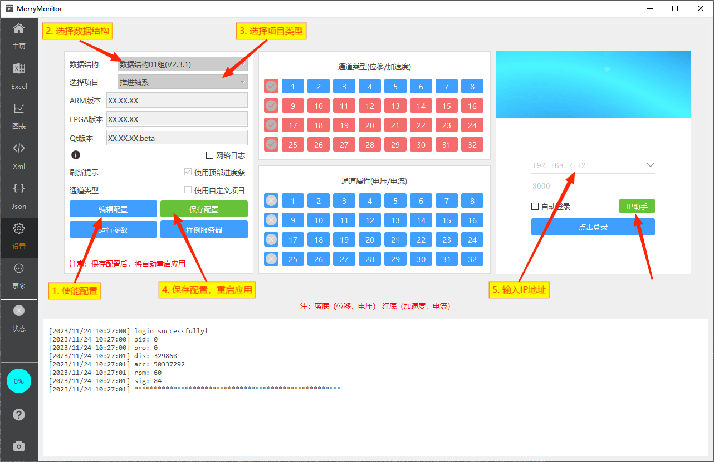

::: info 项目选择
随着时间的推移，不同的项目需求积累了众多的上位机版本。它们之间互相不通用，只对特定项目有效。
作为一名以FPGA开发为主业，长期混迹Linux、前端娱乐圈的算法爱好者。终于忍不住重新拿起Qt，重写了一份全新的桌面程序。

为什么不用Web方案？那当然是想的，但是性能实在是有点绷不住。

正因如此，才更希望能通过这一版桌面程序，解决混乱的测试流程。
一个好的设计模式非常重要！在这个项目中，借鉴了前端框架的设计思想与一些算法技巧，完成了接口的统一抽象。

**现在，这是一个可以兼容绝大多数以往项目的应用程序。**
:::

## 页面标注

连接设备网络前，请先选择合适的数据结构组与项目。同时注意中间的通道类型与属性，是否与当前设备情况保持一致。

## 选择内置项目

::: info 操作流程
1. 点击**编辑设置**，使能 **数据结构、选择项目、自定义项目** 等配置项。
2. 点击**数据结构、选择项目**，按照当前正在进行的项目，选中对应的项目。
3. 在右侧登录框中输入设备的IP地址及端口号，下拉框中内置了一些常用IP地址。
4. 如需在设备启动后，自动进行登录操作，可勾选自动登录。
5. 点击左侧保存设置，将选择后的配置保存至本地，配置将在下次启动时生效。
6. **重启测试软件。**
:::

## 选择自定义项目

当你正在测试的设备，不属于内置项目的一种，但其数据结构又归属在某个数据结构分组下。你可以使用自定义项目功能。

::: info 操作流程
1. 点击**编辑设置**，使能 **数据结构、选择项目、自定义项目** 等配置项。
2. 点击**自定义项目**，这时，左侧的通道类型、通道属性的将使能。
3. 你可以通过点击这些类型、属性按钮调整配置，以适配你当前正在进行的测试设备。
4. 点击**数据结构**，选择合适的数据结构分组。
5. 在右侧登录框中输入设备的IP地址及端口号，可勾选自动登录。
6. 点击左侧保存设置，将选择后的配置保存至本地，配置将在下次启动时生效。
7. **重启测试软件。**
:::

## 网络连接

应用程序在IP下拉框中，内置了部分常用的IP地址。
勾选自动登录的情况下，应用程序启动时，将会为你尝试使用保存的地址进行登录。（相当于桌面程序启动后，主动为你点击了登录按钮）

应用程序的日志系统，仅保留了网络部分的日志信息。以避免在长期运行的设备中，出现太多不关心的日志输出。
日志内容主要集中在网络登录、连接、断开。重连等行为。

**每当加速度数据包刷新时，将引起观察窗口标题的变化，以及默认开启的顶部进度条的刷新。**

你可以通过这两种方式观察数据包的刷新情况。

## 关于项目

::: tip
关于桌面程序的开发过程，基本是在作者的周末时间与平时的熬夜中完成。

设计开发的动力，一方面是为了重新熟络Qt的开发知识，一方面也为自己丰富简历，深挖护城河。至于是否真正的解决了项目混乱的问题，我本人并没有多在意。

这是我的个人项目，不涉及任何商业行为，随时都可以选择放弃维护。
:::
