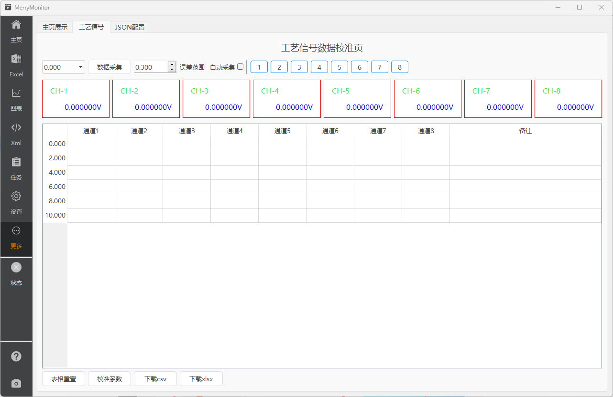

::: info
V2.0版本新增的测试条目，需要对采集的工艺信号进行线性回归。

由于当前阶段工艺信号的数量不可控，只在个别的项目中存在。不适合将工艺信号的采集流程作为常驻功能集成在数据主屏上。

因此，作为可以控制增减的功能页，放置在二级导航里。
:::

## 页面标注

功能页将数据主屏与测试表格的部分功能进行了压缩删减与集成。目前最多支持8组工艺信号，根据需要可扩展通道数。

## 自动采集

自动采集功能请参考 [数据主屏](./monitor.md#自动采集)。

使用自动采集功能的过程中，应用程序将接管 **测试电压、数据采集** 这两个功能按钮。

## 通道使能

应用程序默认开启了8个通道的使能，点击可关闭，所见即所得。

## 测量误差

测量误差说明请参考 [测试表格](./excel.md#测量误差)。

## 线性回归

线性回归系数文件的默认名为 `SIGCorrect.xml`，点击可下载。
