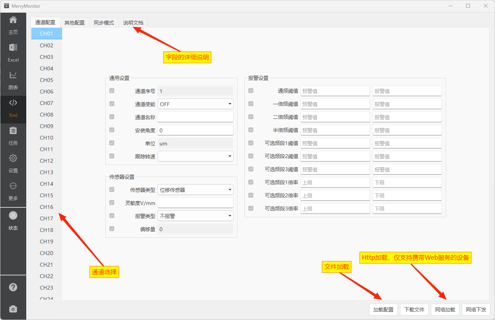

::: info 配置可视化
长久以来，XML配置文件的修改都是围绕文本编辑器进行。这种方式不仅效率低，且出错率还高。非常不适合开发人员之外、不熟悉标签定义的其他人员使用。

因此，一个可视化的配置界面，不仅必要也非常重要。

当前的配置界面，沿用了作者两年前完成的UI界面。而其中的UI操作逻辑与XML的解析转存的方式，则全部进行了重写。
采用了一套更高效更通用的模型，替换了原来的后台操作逻辑。并将UI与后台进行了解耦，在其解析效率、稳定性得到提高的同时，也更容易支持后续的升级。
:::

## 页面标注

图表功能提供了丰富的辅助控件，基本涵盖了大多数的应用场景与测试任务。

::: tabs

@tab 通道配置

@tab 说明文档

:::

## 通道配置

点击左侧通道按钮，中央区域的配置界面将切换到对应的通道内容。

报警设置项中，七种不同的报警类型中只能选择其中一个。如果您需要全部关闭，可点击类型按钮上方的RST复位按钮。

::: warning
下载XML文件前，你必须确保已经加载了一个 `settings.xml` 文件，应用程序需要使用模板文件以确保不会遗漏那些 **你正在使用，但又不需要可视化** 的标签。

例如：`<copyrights></copyrights>`、`<version></version>` 标签等。
:::

## 同步模式

有时候，我们需要对部分配置内容同时更新到多个不同的通道。

例如：当我们有一个需要对通道1-16的灵敏度，修改为同一个值的场景。如果我们在通道配置页下进行修改，则需要打开1-16通道的配置内容，分别进行修改。
这不仅步骤繁琐，且容易遗漏部分通道的修改。

同步模式就是在这种应用场景下推出的解决方案。

容我使用刚才的栗子。在同步模式的情况下，修改灵敏度的步骤如下：

::: tip
1. 打开配置项前的使能开关。(这里打开的是灵敏度的使能开关)
2. 修改灵敏度的值。
3. 点击左侧按钮，选中需要同步的通道。(这里提供了一组快速选中的按钮组)
4. 点击同步修改，将勾选的配置内容同步至所有选中的通道。
5. 回到通道配置页，查看修改情况。
:::

## 注意事项

::: warning
由于XML标签包裹下的数据，最终都会转换为字符串，而项目配置的情况又让人出乎意料。
因此，早期为配置项提供的表单校验，目前已全部取消。

你需要为你自己填写的配置项，**考虑其数据合法性**。应用程序不再提供表单检验服务。
:::
