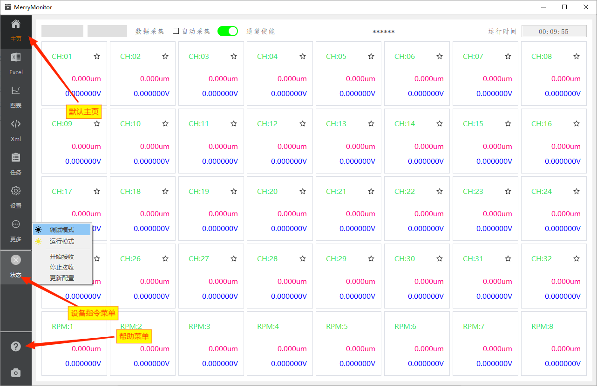
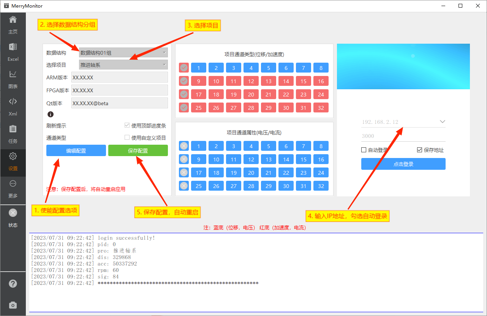

::: info 工具介绍
Merry Monitor 是一款由 Qt 桌面 UI 框架构建的高性能图表展示与表格测试软件。
支持多种项目类型的网络协议转换，统一风格的UI展示逻辑。
内置常用类型的测试项目表格，高可靠易扩展的设计模式与软件架构，方便支持后期持续添加新类型的测试项目表格。

自带XML配置文件可视化修改方案。对不同项目不同字段的配置文件，保留了相同属性字段的最大集，力求争取最大程度地适配不同类型的测试项目。

工具软件主体部分，源于作者早期个人编写的独立模块。**网络协议敏感部分，可单独剥离出软件，主体功能不受影响**。
:::

## 内存要求

软件启动后构建窗口资源的内存占用小于100M。连接网络服务后，网络数据包的积压缓存需占用大约70M的内存。
CPU占用率高峰约为5%（以电脑配置实际情况为准），可在绝大多数电脑上稳定运行。

## 启动软件

进入应用，初始停留在主页功能页上。如下图：

## 初始化项目

观察侧边栏，点击设置页，首次进入项目配置时，按以下步骤进行操作：

1. 点击编辑设置，使能配置项。
2. 点击数据结构，按照当前正在进行的项目，选中对应的项目。
3. 在右侧登录框中输入设备的IP地址及端口号，下拉框中内置了一些常用IP地址。
4. 如需在设备启动后，自动进行设备登录，可勾选自动登录。
5. 点击左侧保存设置，将选择后的配置保存至本地，配置将在下次启动时生效。
6. **重启测试软件。**

## 查看图表

设备网络**正确建立连接**后，可点击图表页查看具体类型的图表内容。
曲线图默认支持滚轮与拖动**横向缩放**，同时提供了**纵向缩放**的切换开关。

> **一般地，在使用缩放功能观察图表时，应将刷新使能关闭，以避免需要观察的数据因为刷新而丢失！**

## 发送指令

设备连接成功后，侧边栏状态按钮将显示绿色连接状态。点击按钮可弹出常用指令菜单，通过此菜单向设备发起指令请求。

一般而言，**加速度信号刷新时间最长**。因此，顶部进度条跟随加速度数据包的刷新而归零。同时，顶部窗口名称更新为最后一次的刷新时间。

更多操作细节可查看具体的操作手册！
