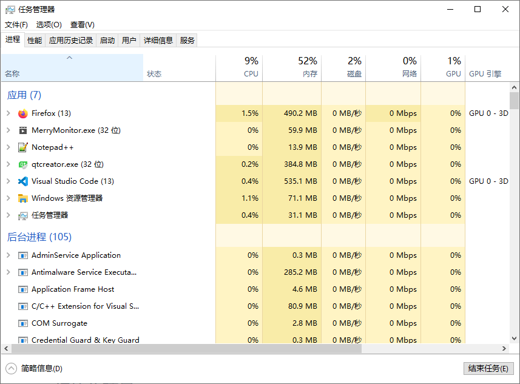

::: info 工具介绍
Merry Monitor 是一款由 Qt 框架构建的图表展示与集成测试任务的桌面软件。

支持多种项目类型的网络协议转换，风格统一的UI展示逻辑。
内置常用的测试表格，易扩展的设计模式，方便支持后期添加新类型的测试表格。

提供XML、JSON配置文件两套可视化修改方案。对不同项目不同字段的配置文件，保留了相同属性字段的最大集，争取最大程度地适配不同类型的测试项目。

软件整体由多个独立模块与全局 Context 组装而成。**功能模块可自由拆卸或扩展，项目之间的差异，内聚在单独的网络协议兼容层，最大程度地控制差异的影响**。
:::

## 内存要求

Win10系统上，软件启动后构建窗口资源的内存占用大约80M。连接网络服务后，网络数据包与图像数据的缓存需占用大约80M的内存。
CPU占用率约3%（以电脑配置实际情况为准），可在绝大多数电脑上稳定运行。

## 启动软件

打开应用后，默认停留在主页功能页上。如下图：

## 初始化项目

观察侧边栏，点击设置页，首次进行项目配置时，按以下步骤进行操作：

1. 点击编辑设置，使能配置项。
2. 按照当前设备的数据结构类型选择分组（每个分组都可以试一试，看看有哪些项目）。
2. 按照当前正在进行的项目，选中对应的项目。
3. 在右侧登录框中输入设备的IP地址及端口号，下拉框中内置了一些常用IP地址。
4. 如需在设备启动后，自动进行设备登录，可勾选自动登录。
5. 点击左侧保存设置，将选择后的配置保存至本地，配置将在下次启动时生效。
6. **自动重启测试软件。**

## 查看图表

与测试设备**正确建立网络连接后**，点击侧边栏图表页查看具体类型的图表内容。

加速度图谱，在V2.0版本后提供了分离窗口功能，可单独创建一个新的窗口。使用此功能，可同时观察多个通道的图谱情况。

分离窗口后的情况。

## 发送指令

设备连接成功后，侧边栏状态按钮将显示绿色连接状态。点击按钮可弹出常用指令菜单，通过此菜单向设备发起指令请求。

一般而言，**加速度信号刷新时间最长**。因此，顶部进度条跟随加速度数据包的刷新而归零。同时，顶部窗口名称更新为最后一次的刷新时间。

更多操作细节可查看具体的操作手册！
